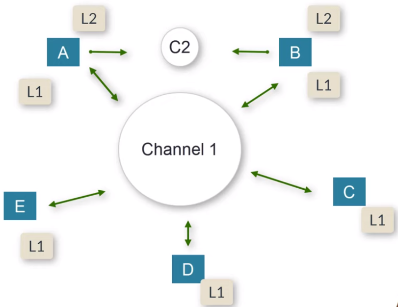
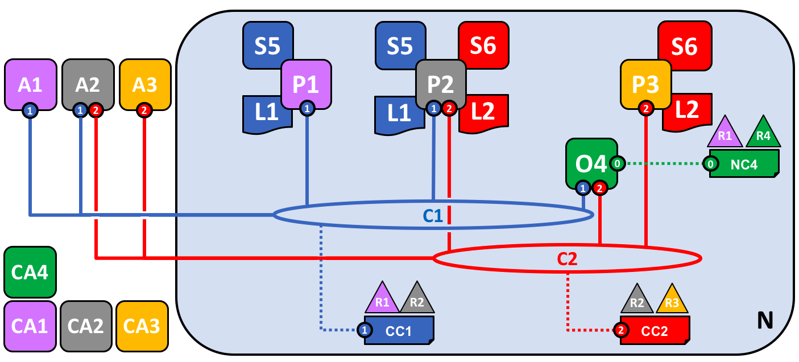

# Hyperledger Fabric Tutorial:

The hyper ledger is a project in which you have diff frameworks and tools avalible.
one of this is hyperledger fabric


## About Public Blockchain:
- `bitcoin blockchain:` It only store trasactions / data .This network cannot be used to do programming. 

- Change the existing internet to new internet which is the decetralised internet. To achive that we have to write softwares which run on this decentralised internet. These softwares are called Dapps.

- In Etherium, not only data but also softwares which run on blockchain network.

- The main problem of public blockchain is that it is transparent.
- The main advantage of public blockchain is consennsus protocol 
  - proof of work and proof of stake


## About Private Network: 



- Private Blockchain Networks are `private and permissioned`. create a subnet for business to keep their transactions private.
- The HyperLedger is a project open source project by Liux foudation. The HyperLedger fabric is one of that project.   
- Fabric is a pvt blockchain network and it have the subnets features and we call them as `channels`.
- The enrollment to the network can only be done through `MSP(Membership Service Provider)`.The members of a Hyperledger Fabric network enroll through a trusted `Membership Service Provider (MSP)`.
- we can write `smart contracts` in hyperledger fabric with the help of `chaincode`.The chaincode can be written in JS,Java,GO language.The Fabric is build in GO so they prefer using Go language to build chaincode.
- The `Ledger` is kind of like a database but in hyperledger fabric leger is divided into 2 parts : (2 comp of ledger)
  1. `World State:` Current state of data / real state of data can be fetched from world data (who has the asset right now). 
    - Get this by using some RDBMS : couchDB or levelDB.
  3. `Transaction Log:` To find the source of the assest (where). so this is like a transaction logs. This can be stored in simple plain file.

- `If u are wroking with hyperlegder fabic, you have to work with the channel. Each channel will have peers and each peer will have chaincode.`

- CCP files = Common Connection Profile(CCP):
- Anchor peers:
- endorsor peers:
- order peers:

## Understanding Key Concepts:

- Network - N
- orgaisation - R
- Network Config - NC
- Certificate Authority - CA : Diff org have diff CA's
- Orderer of peer - O
- Consortium - X : It is the collection of multiple org attaining the same goals. `“a group with a shared destiny”`
- Channel - C
- Channel Config -CC
- Peer - P
- Ledger - L
- Smart Contract - S



## Lets design the network:

### Step 1:  
- Network as `N` . `R4 organisation` creates the network for that it creates a `network config` which is called `NC4`. `Orderer(O4)` will use NC4 to instatiate the network for that componets are required. 
- but for a component to exist in the network it has to be authorised  and this is what `certificate authorities(CA4)` does. So diff orgaisations have diff CAs / all the organisation can have the same CA.   

### Step 2: 
- R4 can share the rights to the network (Admin) with R1. Both handles network configrations in which  R4 is not interested (താല്പര്യം) to do any transaction/communication on the network.
- `Consortium (X1)` is a collection of multiple organisation attaining(നേടുന്നു) the same goals. X1 is the collection of R1 & R2.  
- The big Network N have smaller networks(Subnets) and this is called `Channel(C1)`. 
- The NC dont have any say on channel configs. so `channel configs (CC1)` are used and this is managed by R1 & R2.

### Step 3:
- A Channel will have multiple `Nodes(P1)` and each Nodes may have diff `Ledger(L)` for each channel.
- The user will interact though an `Application(A)` with the blockchain network.A1 is the outside component and A1 requests are accepted by the `chaincode which is a smart contract`. chaincode acts out those requests in the blockchain network and return the result to the A1 app.   
- So chaincode(S5) is a code written inside the nodes.  
- `Muliple nodes can be used in the a channel(C1) with the same ledger and same chaincodes`. 
-  R3 & R4 dont interacts with C1 channel. 
- `Think of smart contracts as governing transactions, whereas chaincode governs how smart contracts are packaged for deployment`.


## Prerequisites:

- Git:
`sudo apt-get install git`

- cURL:
  `sudo apt-get install curl`
- Install docker:
  `sudo apt-get -y install docker-compose`
- Make sure the Docker daemon is running:
  `sudo systemctl start docker`
- Install go
- Install JQ (only required if you will be writing Go chaincode or SDK applications).

### Download the latest release of Fabric samples, docker images, and binaries:

`> curl -sSL https://bit.ly/2ysbOFE | bash -s [version-no]`

## Fabric 1.0:

FILE LOCATION: `[fabric-samples/firstt-network/]`

```
  > ./byfn.sh
  > ./byfn.sh generate
  > ./byfn.sh up
  > ./byfn.sh down  
  > ./byfn.sh up -l java
  > docker rm -f $(docker ps -aq)
  > docker rmi -f $(docker images | grep fabcar | awk '{print $3}')
```
## Fabric 2.0 :

**Using the Fabric test network:**

```
  > ./network.sh down
  > ./network.sh up
  > docker ps -a
  > ./network.sh createChannel -c [channel-name]
```

## Create Basic Network with Hyperledger Fabric v2.0
 I like to mention `@adhavpavan tutorial`[https://www.youtube.com/playlist?list=PLSBNVhWU6KjW4qo1RlmR7cvvV8XIILub6] which helped me a lot.
 
### Network Details:

- Two Organizations
- Two peers in each Orgaisation
- One CA for each Organisation
- 5 Orderer(`RAFT`)
- State Database: Couch DB
  - **Why use Couch DB over level DB ?** It enables to run complex queries.

## Folder Structure:

- It is created by taking ref from first network and test network of their official documentation.
- app folder: this is used when we write our API's
- `Artifacts folder`: one of the most imp folder in fabric network.
  - `channel`
    - configtx.yaml
    - crypto-config.yaml
    - `config`
      - core.yaml
  - `src`: will have our smart contracts that is the chaincode. fabic 2.0 have introduced a contract api for writing the chain code which support multiple smart contacts within a single chain
  - base.yml: this is the common part for starting the peer.
  - `docker-compose.yaml`: will have all the services we require for creating our network.
  - network-config.yaml:diff files which will require for writing the APIs in node
  - org1.yaml: this the connection profile file which will be required for writing the api's
  - `chanel.artifacts`
  - app.js : This is to create a server to interact with the network
  - cleanup.sh:to clean the network
  - `crypto-config` : here we will have all the identities certificate,public , private keys of all the organisations
    - org 1: structure will be common for all our identities.
      - ca
        - ca certificate and pvt key
      - msp
        - admincerts
        - cacerts
        - tlccacerts
      - peers: we can have multiple peers in network of org
        - each peers will have msp and tls.
        - `msp`
          - keystore : were the pvt key gets stored
          - signcerts:this is the certificate of this peer.
      - tlsca(trasport layer security)
      - users
  - config.js and config.json is used to write APIs.
  - depoloyChaincode.sh

#### 1. CryptoConfig: Create Crypto Materials

#### 2. Configtx File: Create Network Artifacts

#### 3. Docker Compose: Details of services in docker-compose.yaml file

#### 4. Doing Network Up with docker-compose.yaml:

#### 5. Create Channel and Join all Peers

#### 6. Anchor Peer & Leader Peer: Configure peers

#### 7. Chaincod Lifecycle in fabric v2.0

#### 8. Chaincod Lifecycle - Package & Install chaincode

#### 9. Chaincod Lifecycle - Approve, Commit, Instantiate, Invoke, Query

#### 10. Network With three Raft Orderer

#### 11. Create Network Using Defined Scripts

#### 12. Chaincode (Smart Contract) Walk-through

#### 13. Fabric SDK fabric client and fabric network

#### 14. Fabric SDK (fabric client) - Folder Structure & NetworkConfig File

#### 15. Fabric SDK (fabric client ) - Register New User using CA

#### 16. Fabric SDK (fabric-client) - Transaction Invocation- Create Asset

#### 17. Fabric SDK (fabric client) - Query Transaction

#### 18. Fabric SDK (fabric client) Update Transaction

#### 19. Fabric SDK (fabric client ) - Get Transaction By TxId

#### 20. Fabric SDK fabric client Get Block By Block Number

#### 21. Fabric SDK - Get History For Asset

#### 22. Fabric SDK - Create Composite Key: Couch DB

#### 23. Containerizing Blockchain Explorer and Integrate with Hyperledger Fabric Network

#### 24. Implementing Chaincode(Smart Contract) Logging in Hyperledger fabric

#### 25. Transaction Flow in Hyperledger Fabric: Basic Network Fabric v2.0

#### 26. Attribute Based Access Control in Hyperledger Fabric 2.0

#### 27. Genesis Block and Channel Block in Hyperledger Fabric

#### 28. Ledger(Database) in Hyperledger Fabric

#### 29. Chaincode (Smart Contract) Upgrade

#### 30. RAFT Simulation

#### 31. Fabric Network Client API SDK

#### 32. Register User using Fabric Network Client API

#### 33. Invoke Transaction using Fabric Network Client API

#### 34. Query Transaction using Fabric Network Client API

#### 35. Create Certificate Using Certificate Authority:

#### 36. Transaction Signature validation at Endorsing Peer

#### 37. Create Certificates Using Certificate Authority

#### 38. Create Certificates Using Certificate Authority

#### 39. Create Certificate Using CA - Invoke Transaction using new created certificates

#### 40. Importing Postman API Collection

#### 41. Fabric Network SDK: Generic API for registering new User for any Org

#### 42. Private Data Collection (Explicit & Implicit) Implementation in Hyperledger fabric

#### 43. Data Persistance : Hyperledger Fabric Network 2.X

#### 44. Fabric Advanced Operations (Add new Org/Orderer in running network) - New Course Introduction

#### 45. Get Tx By TxId, Block By Block Number using Fabric-network SDK(QSCC)- Fabric v2.x

#### 46. Discovery Service: Roles and Responsibilities - Fabric v2.x

#### 47. Contract API Part 1 - Setting up new Repo and creating Network: Hyperledger fabric 2.x

#### 48. Contract API Part 2 - Create Chaincode using Contract API: Hyperledger Fabric

#### 49. Contract API Part 3 - Install Multiple Smart Contract on Same Channel

#### 50. Contract API Part 4 - Cross chaincode Communication: Hyperledger Fabric

#### 51. Contract API Part 5 - Add Multiple Smart Contract in same chaincode

#### 52. Contract API Part 6 - Add Contract Listener: Hyperledger Fabric

#### 53. Contract API Part 7 - Add Block Listener : Hyperledger Fabric
